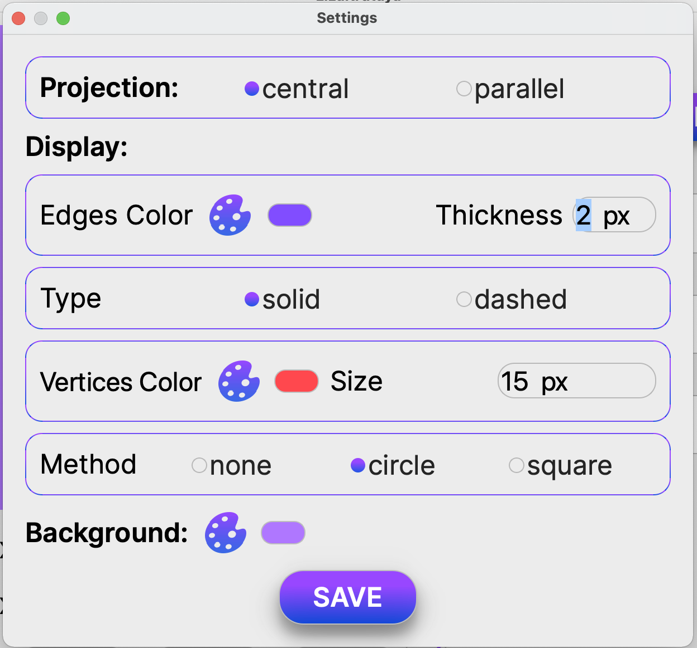

# 3DViewer v1.0

3DViewer представляет из себя программу для просмотра 3D моделей в каркасном виде. Программа реализована на языке программирования Си с использованием Qt (фреймворк для разработки кроссплатформенного программного обеспечения на языке программирования C++).

## Информация

Сами модели загружаются из файлов формата .obj и есть возможность просматривать их на экране с возможностью вращения, масштабирования и перемещения.

Каркасная модель - модель объекта в трёхмерной графике, представляющая собой совокупность вершин и рёбер, которая определяет форму отображаемого многогранного объекта в трехмерном пространстве.

Файлы .obj - это формат файла описания геометрии, впервые разработанный компанией Wavefront Technologies. Формат файла открыт и принят многими поставщиками приложений для 3D-графики.

Формат файла .obj - это простой формат данных, который представляет только трехмерную геометрию, а именно положение каждой вершины, положение UV координат текстуры каждой вершины, нормали вершин и грани, которые определяют каждый многоугольник как список вершин и вершин текстуры. Координаты obj не имеют единиц измерения, но файлы obj могут содержать информацию о масштабе в удобочитаемой строке комментариев.

## Функционал

### Основные функции 3DViewer:

- При запуске программы открывается главное окно программы, где расположен блок для просмотра моделей; кнопка окрытия файла; кнопка открытия настроек; текстовые блоки для вывода названия,количества ребер и вершин фигуры; текстовые блоки и кнопки для scale, rotate и translate;
- Возможность перемещать модель на заданное расстояние относительно осей X, Y, Z;
- Возможность поворачивать модель на заданный угол относительно своих осей X, Y, Z;

- При нажатии на кнопку настроек открывается окно, где можно поменять тип проекции (параллельная и центральная), тип (сплошная, пунктирная), цвет и толщину ребер, способ отображения (отсутствует, круг, квадрат), цвет и размер вершин, выбирать цвет фона. Настройки сохраняются и при последующем открытии программы они останутся в том виде, в каком пользователь вышел из программы (с условием, что настройки были сохранены и файл не был нарушен);

- Возможность загружать каркасную модель из файла формата obj (поддержка только списка вершин и поверхностей);

- Программа позволяет сохранять полученные ("отрендеренные") изображения в файл в форматах bmp и jpeg;
- Программа позволяет по специальной кнопке записывать небольшие "скринкасты" - текущие пользовательские аффинные преобразования загруженного объекта в gif-анимацию (640x480, 10fps, 5s).

