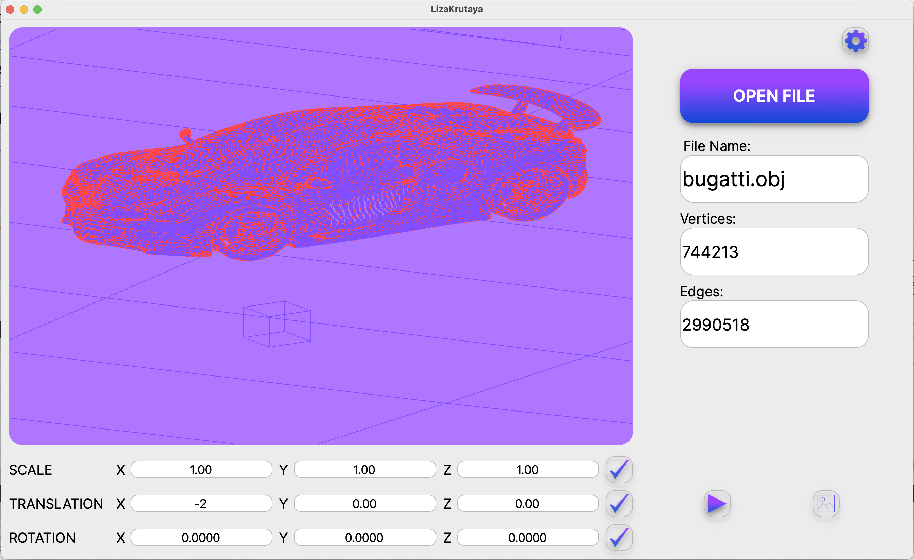

# The most interesting projects from school21

Здесь собраны самые запоминающиеся проекты из школы:

(~~Некоторые проекты сделаны совместно с командой = "team"~~)

## C projects

  
3DViewer с интерфейсом на QT на OpenGL от 05/07/22(team)

  
  ### Что это и как запускается?
  1. Это программа для просмотра 3D моделей в каркасном виде. Приложение реализовано на языке си под Mac, запуске под MinGW приводит к крашу из-за использования getline. Обеспечено покрытие интеграционными тестами афинных преобразований.
  2.  На маке можно скомпилировать через make и запустить приложение из папки build
  
  
  
  

  
Smart_Calculator с интерфейсом на QT от 16/05/22

  
  ### Что это и как запускается?
  1. Это калькулятор, написанный на си с интерфейсом на QT, описание его возможностей расположено в html файле в папке соответствующего проекта.
  2. Вполне вероятно, что мой мэйк подойдет только для пользователей мака, однако это не конец света! ~~Я не гений десктопных приложений, поэтому чтобы посмотреть на калькулятор в работе вам можно установить QT, тыкнуть на файл с расширением pro, подтвердить конфигурацию и запустить! Вот и все)~~
  
  
  

  
Matrix от 04/04/22

  
  ### Что это и как запускается?
  1. Реализована структура матриц на си, различные операции с ними, есть покрытие тестами на check 
  2. Как запускать на линуксе:
     * Для запуска make, но не все так просто, там создается статическая библиотека и тестикии

  
Decimal от 23/03/22(team)

  
  ### Что это и как запускается?
  1. Ну вот вспомните как в компьютере хранятся числа с плавающей запятой, ну и вот, здесь собраны операции с ними, сравнения и преобразование типов + тесты, которые были сделаны при поддержке С# (спасибо Захару, что может). Для тестов все так же нужна библиотека check
  2. Как запускать на линуксе:
     * Для запуска make, там создается статическая библиотека ~~так еще и такое число тестов, какого я не знаю~~

  
Mathhhh от 05/03/22(team)

  
  ### Что это и как запускается?
  1. Написаны основные функции библиотеки math.h + есть проверка на корректноость работы через библиотеку check(ее надо ставить)
  2. Как запускать на линуксе:
     * Для запуска make, там создается статическая библиотека

  
Натуральный баш: cat и grep с тестами от 12/01/22

  
  ### Что это и как запускается?
  1. Написаны 2 команды cat и grep, которые работают практически так же как оригинальные (за исключением некоторых моментов). Cat при попытке отрытия не
  2. Как запускать на линуксе:
     * Для запуска тестов из скрипта make testsCat или testsGrep, для запуска самой программы make s21_cat или s21_grep, тесты лежат в соответсвующих папках

  
Игра "Жизнь" от 25/07/21(team)

  
  ### Что это и как запускается?
  1. Терминальная пошаговая игра на двоих, с выводящимся счетом и полетом мяча по нажатию на движение
  2. Как запускать на линуксе:
     * В терминале пишем life1, life2, life3, life4 или life5, можео просто all, но на вход требуется матрица из 0 и 1

  
Пошаговый Ping Pong от 18/07/21(team)

  
  ### Что это и как запускается?
  1. Пошаговая терминальная игра-симмулятор, имеется несколько файлов для просмотра процесса игры. Управление кнопками A и Z для левой ракетки, K и M для правого, space для бездействия и затем enter. Выход по окончании игры(21 гол) или нажатием ctrl+C
  2. Как запускать на линуксе:
     * В терминале пишем make

